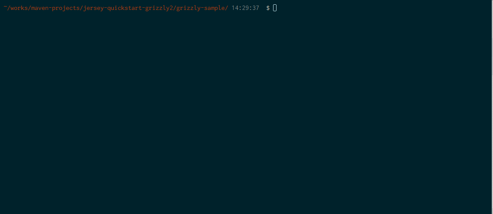

# Maven Plugin for Oracle Application Container Cloud Service

[Oracle Application Container](https://cloud.oracle.com/acc) 用の Maven プラグインです。このプラグインと以前作成していた Oracle Storage Cloud Service 用の Maven プラグインを組み合わせて使用する事により、Maven ゴールのみで開発からデプロイまで実施することができるようになります。

- [Oracle Storage Cloud Service の Maven プラグインを作ってみた](http://qiita.com/shinyay/items/69fab755212ab31f7319)
  - [scs-maven-plugin
](https://github.com/shinyay/scs-maven-plugin)

## 説明

[Oracle Application Container](https://cloud.oracle.com/acc) (略称: ACCS)は、多言語のアプリケーションを簡単に稼働させる事ができ、またスケーラブルの実行環境を提供するクラウドサービスです。

アプリケーションを開発して、Zipにアーカイブして、デプロイするのみでアプリケーション実行環境が用意されます。

このクラウドサービスの基盤は、Docker が利用されているので、実行環境の立ち上げや、スケーリングは軽量かつ高速に実行する事ができます。

一方で Docker のインターフェースは ACCS によりラップされているため、ACCS の利用者は Docker の操作や管理、構成などを考慮する必要がありません。そのため、開発者は `Dockerfile` や `docker-compose.yml` の構成を意識する事なくアプリケーション開発のみに注力する事ができます。

このようにアプリケーション開発者が、Docker の学習コストをかける事なく軽量・スケーラブルなアプリケーションを利用できるのが ACCS です。

この ACCS にアプリケーション開発者にとってよく使われる **Maven** から直接 ACCS を操作できるようにしているのが、この **accs-maven-plugin** です。

## 動作イメージ



accs-maven-plugin を利用した操作イメージです。アプリケーションのビルドから ACCS へのデプロイまでを Maven を使ってシームレスに実施しています。

この動作イメージでは、以下の流れで Maven ゴールを実施しています:
- コンパイル
- JAR のパッケージ
- ACCS 用のメタファイルの生成
- ACCS 用のアプリケーションパッケージの生成
- アプリケーションパッケージのアップロード
- ACCS へのデプロイ

## 特徴

このプラグインでは、現在以下の機能を実装しています (2017/3/1時点):

- ACCS へのデプロイ
- デプロイ用メタ情報ファイルの生成
- アプリケーション用メタ情報ファイルの生成
- ACCS 用のアプリケーションパッケージの生成
- ACCS デプロイ済みアプリケーションの一覧表示

## 前提

- Maven 3
- Java 1.8

## 使用方法

### ACCS へのデプロイ

- コマンド: `accs:create`

#### pom.xml の記述

ACCS のインスタンスに関する情報を `<configuration>` の配下に記述します。

```xml
<configuration>
    <region>emea</region>
    <identitydomain>${opc.identitydomain}</identitydomain>>
    <user>${opc.user}</user>
    <password>${opc.password}</password>
    <storage>${scs.container}</storage>
    <appName>MY-APP</appName>
    <runtime>java</runtime>
    <subscription>Hourly</subscription>
    <archiveURL>${scs.container}/${project.name}-${project.version}.zip</archiveURL>
</configuration>
```

- **region**: 使用しているデータセンターがある地域
  - `us` 又は `emea`
- **identitydomain**: 使用しているアイデンティティ・ドメイン名
- **user**: ユーザー名
- **password**: パスワード
- **storage**: デプロイするアプリケーション・パッケージをアップロードしている Storage Cloud Service のコンテナ名
- **appName**: ACCS に登録するアプリケーション名
- **runtime**: アプリケーションのランタイム
  - `java` 又は `node` 又は `php`

  > 現時点のプラグインでは　`java` のみの対応です (2017/3/1)

- **subscription**: 契約タイプ
  - `Hourly` 又は `Monthly`
- **archiveURL**: アプリケーション・パッケージ名 (ストレージコンテナ名を含む)

### デプロイ用メタ情報ファイルの生成 (deployment.json)

- コマンド: `accs:create-deployment`

#### pom.xml の記述

デプロイメントに関する情報を `<configuration>` の配下に記述します。

```xml
<configuration>
    <metaJsonPath>${project.basedir}\metafiles</metaJsonPath>
    <memory>1G</memory>
    <instances>1</instances>
</configuration>
```

- **metaJsonPath**: デプロイ用メタ情報ファイル (deployment.json) の出力先
- **memory**: ACCS インスタンスに割り当てるメモリ容量
- **instances**: インスタンス数

### アプリケーション用メタ情報ファイルの生成

- コマンド: `accs:create-manifest`

#### pom.xml の記述

アプリケーションに関する情報を `<configuration>` の配下に記述します。

```xml
<configuration>
    <metaJsonPath>${project.basedir}\metafiles</metaJsonPath>
    <archiveName>${project.name}-${project.version}</archiveName>
    <majorVersion>8</majorVersion>
    <command>java -jar ${project.artifactId}-${project.version}.jar</command>
    <version>${project.version}</version>
</configuration>
```

- **metaJsonPath**: デプロイ用メタ情報ファイル (manifest.json) の出力先
- **archiveName**: アプリケーション・パッケージ名 (拡張子不要)
- **majorVersion**: ランタイム・バージョン
    - In the case of `java` のバージョン (現在 Javaのみの対応)
      - `8` 又は `7`
- **command**: 起動コマンド
- **version**: バージョン情報

### ACCS 用のアプリケーションパッケージの生成

- コマンド: `accs:package`

アプリケーションファイルと manifest.json を含んだパッケージを生成します。

### ACCS デプロイ済みアプリケーションの一覧表示

- コマンド: `accs:list`

ACCS にデプロイされているアプリケーション一覧情報を表示します。

## 導入手順

`accs-maven-plugin` を利用するには、`pom.xml` にプラグインの依存関係を追加することで使用できます。

ただし、ACCS のコンテナは動的に作成され、ホスト名やポート番号といった環境情報も動的に生成されます。そこで ACCS 上で稼働するアプリケーションは環境情報は環境変数から読み込むようにしておく必要があります。また、Java の場合は実行可能な Uber JAR (Fat JAR) にしておく必要があります。

アプリケーションの観点とpom.xmlの観点での導入方法を次に説明します。

### ACCS 用の Java アプリケーション

例として Server Framework の Grizzly を組み込んだアプリケーションを用います。

#### 1. Maven プロジェクトの作成

Maven の `archetype:generate` ゴールを用いて Grizzly のプロジェクトを作成します。

以下のパラメータは適当なものを入力してください。

- GROUP_ID
- ARTIFACT_ID
- PACKAGE

```
mvn archetype:generate \
        -DarchetypeGroupId=org.glassfish.jersey.archetypes \
        -DarchetypeArtifactId=jersey-quickstart-grizzly2 \
        -DarchetypeVersion=2.25.1 \
        -DinteractiveMode=false \
        -DgroupId=${GROUP_ID} \
        -DartifactId=${ARTIFACT_ID} \
        -Dversion=1.0.0-SNAPSHOT \
        -Dpackage=${PACKAGE}
```

#### 2. Maven プロジェクトの作成

`archetype:generate` ゴールを実行すると、`Main.java` と `MyResource.java` が生成されます。`Main.java` で Grizzly を起動しているので、こちらを編集します。

以下のように環境変数からホスト名とポート番号を取得するように変更します。

- 変更前

```java
public class Main {
    // Base URI the Grizzly HTTP server will listen on
    public static final String BASE_URI = "http://localhost:8080/myapp/";
```

- 変更後

```java
public class Main {
    // Base URI the Grizzly HTTP server will listen on
    public static final String BASE_URI = "http://"
            + Optional.ofNullable(System.getenv("HOSTNAME")).orElseGet(() -> "localhost")
            + ":"
            + Optional.ofNullable(System.getenv("PORT")).orElseGet(() -> "8080")
            + "/myapp/";
```

一応 deprecated になっている停止処理も修正しておきます。
- 変更前
  - `server.stop();`
- 変更後
  - `server.shutdownNow();`

#### 3. Uber JAR の構成

`maven-shade-plugin` を用いて **Uber JAR** を構成します。

以下のようにプラグインの依存関係を追加します。

```xml
<plugin>
    <groupId>org.apache.maven.plugins</groupId>
    <artifactId>maven-shade-plugin</artifactId>
    <version>2.4.3</version>
    <executions>
        <execution>
            <phase>package</phase>
            <goals>
                <goal>shade</goal>
            </goals>
            <configuration>
                <transformers>
                    <transformer
                            implementation="org.apache.maven.plugins.shade.resource.ServicesResourceTransformer"/>
                    <transformer
                            implementation="org.apache.maven.plugins.shade.resource.ManifestResourceTransformer">
                        <manifestEntries>
                            <Main-Class>com.oracle.jp.shinyay.grizzly.Main</Main-Class>
                        </manifestEntries>
                    </transformer>
                </transformers>
            </configuration>
        </execution>
    </executions>
    <configuration>
        <createDependencyReducedPom>true</createDependencyReducedPom>
        <filters>
            <filter>
                <artifact>*:*</artifact>
                <excludes>
                    <exclude>META-INF/*.SF</exclude>
                    <exclude>META-INF/*.DSA</exclude>
                    <exclude>META-INF/*.RSA</exclude>
                </excludes>
            </filter>
        </filters>
    </configuration>
</plugin>
```

### accs-maven-plugin の依存関係追加

以下のように **accs-maven-plugin** の依存関係を追加します。またあわせて、**scs-maven-plugin** も追加しています。

```xml
<plugin>
    <groupId>com.oracle.jp.shinyay</groupId>
    <artifactId>accs-maven-plugin</artifactId>
    <version>1.0-SNAPSHOT</version>
    <configuration>
        <region>emea</region>
        <identitydomain>${opc.identitydomain}</identitydomain>>
        <user>${opc.user}</user>
        <password>${opc.password}</password>
        <storage>${scs.container}</storage>
        <appName>my-sample</appName>
        <runtime>java</runtime>
        <subscription>Hourly</subscription>
        <archiveURL>${scs.container}/${project.name}-${project.version}.zip</archiveURL>
        <metaJsonPath>${project.basedir}\metafiles</metaJsonPath>
        <archiveName>${project.name}-${project.version}</archiveName>
        <majorVersion>8</majorVersion>
        <command>java -jar ${project.artifactId}-${project.version}.jar</command>
        <version>${project.version}</version>
        <memory>1G</memory>
        <instances>1</instances>
    </configuration>
</plugin>
<plugin>
    <groupId>com.oracle.jp.shinyay</groupId>
    <artifactId>scs-maven-plugin</artifactId>
    <version>1.0</version>
    <configuration>
        <identitydomain>${opc.identitydomain}</identitydomain>
        <user>${opc.user}</user>
        <password>${opc.password}</password>
        <storage>${scs.container}</storage>
        <object>${project.name}-${project.version}.zip</object>
    </configuration>
</plugin>
```

以下のパラメータは、実際の値に置き換えるかプロパティを使用して設定します。

- opc.identitydomain: アイデンティティドメイン名
- opc.user: ユーザ名
- opc.password: パスワード
- scs.contaienr: Storage Cloud コンテナ名


## Licence

Released under the [MIT license](https://gist.githubusercontent.com/shinyay/56e54ee4c0e22db8211e05e70a63247e/raw/44f0f4de510b4f2b918fad3c91e0845104092bff/LICENSE)

## Author

[shinyay](https://github.com/shinyay)
